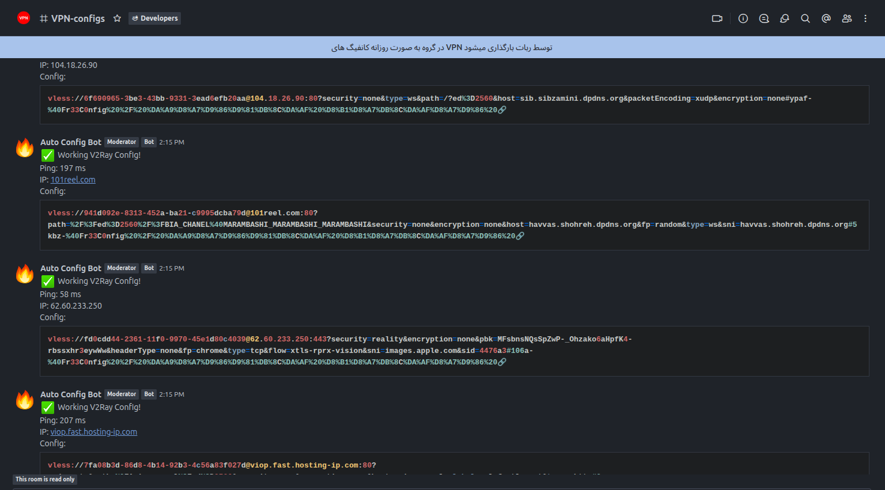

# RocketChat V2ray Hunter



A **Python bot** that fetches, tests, and validates **V2Ray**, **VLESS**, and **Trojan** configurations from a remote subscription URL, measures latency, and posts working configurations to a **Rocket.Chat** channel via webhook.

---

## Features

- **Protocol Support**: VMess, VLESS, Trojan.
- **Automated Testing**: Fetches and tests configurations every 12 minutes by default.
- **Ping/Latency Measurement**: Measures TCP ping for URI configs and full proxy test latency for VMess.
- **Real-Time Notifications**: Posts working configurations to Rocket.Chat with properly formatted code blocks.
- **Handles Large Subscriptions**: Efficiently processes large lists of configs.
- **Emoji & JSON Safe**: Preserves emojis and non-ASCII characters in messages.

---

## Requirements

- Python **3.9+**
- `requests` library (`pip install requests`)
- `v2ray` installed and available in PATH (required to fully test VMess configs)
- A Rocket.Chat **Incoming Webhook** URL

---

## Repository layout

```
.
├── bot.py            # Main bot script
├── config.py         # Your configuration (ROCKET_WEBHOOK, CONFIG_URL, etc.)
├── install.sh        # Installer that creates a systemd service
├── README_FULL.md    # This file
└── requirements.txt  # Python dependencies (requests)
```

---

## Configuration

Create a `config.py` file in the project root with the following variables:

```python
# Rocket.Chat incoming webhook
ROCKET_WEBHOOK = "https://your.rocketchat.server/hooks/XXXXXXX"

# URL that returns subscription lines (vmess://, vless://, trojan://, one per line)
CONFIG_URL = "https://example.com/v2ray_configs.txt"

# Local SOCKS5 port used when launching v2ray for VMess tests
LOCAL_PORT = 1080

# Fetch interval in seconds (default: 12 minutes)
FETCH_INTERVAL = 12 * 60

# URL used to verify proxy (for VMess full tests)
TEST_URL = "http://httpbin.org/ip"

# Optional: channel name for your own records (webhook determines actual channel)
CHANNEL = "#your-channel"
```

---

## Installation

1. **Clone the repository**

```bash
git clone https://github.com/yourusername/rocketchat-v2ray-hunter.git
cd rocketchat-v2ray-hunter
```

2. **Install Python dependencies**

```bash
pip install -r requirements.txt
```

3. **Create `config.py`** and fill in your settings (see Configuration section above).

4. **Test the bot manually**

```bash
python bot.py
```

5. **Install as a systemd service (recommended on Linux)**

Make the `install.sh` executable and run it as root:

```bash
chmod +x install.sh
sudo ./install.sh
```

This script will copy `bot.py`/`config.py` to `/var/rocketv2rayHunter`, create a systemd unit, enable it, and start the service.

---

## Systemd service (example)

If you prefer to create the unit manually, use:

```ini
[Unit]
Description=RocketChat V2Ray Hunter
After=network.target

[Service]
ExecStart=/usr/bin/python3 /var/rocketv2rayHunter/bot.py
WorkingDirectory=/var/rocketv2rayHunter
User=root
Restart=always
RestartSec=10s

[Install]
WantedBy=multi-user.target
```

Save as `/etc/systemd/system/v2ray-bot.service`, then:

```bash
sudo systemctl daemon-reload
sudo systemctl enable v2ray-bot.service
sudo systemctl start v2ray-bot.service
sudo journalctl -u v2ray-bot.service -f
```

---

## How it works

1. The bot downloads a subscription file where each line is a proxy descriptor (`vmess://...`, `vless://...`, `trojan://...`).
2. For `vmess://` entries the bot base64-decodes the payload into JSON, writes a temporary config, launches `v2ray` locally, and issues a test HTTP request through the local SOCKS5 proxy to measure latency and verify connectivity.
3. For `vless://` and `trojan://` entries the bot performs a TCP connect (measures approximate latency). Full protocol verification for those types requires respective clients.
4. Working configs are posted to Rocket.Chat via the configured webhook as formatted messages containing ping and config details.

---

## Security notes

- Keep `config.py` out of version control (add it to `.gitignore`) — it contains your webhook URL.
- Run the service under an unprivileged user where possible (avoid running as `root`).
- Be mindful of the legal and ethical use of proxy servers and configurations.

---

## Troubleshooting

- If VMess tests fail, ensure `v2ray` is installed and can be started by the service user.
- Check logs with `journalctl -u v2ray-bot.service` or the output when running `python bot.py`.
- If webhooks fail, verify the webhook URL and network connectivity to your Rocket.Chat instance.

---

## License

Choose and add a license (e.g., MIT) to your repository.

---

## Contact / Contributing

Contributions, bug reports, and feature requests are welcome — open an issue or submit a PR on GitHub.

